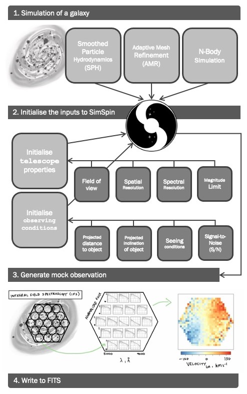

# SimSpin v2.0.6 - A package for producing mock observations of particle simulations

The purpose of the [SimSpin](https://github.com/kateharborne/SimSpin) package is to take a particle simulation of a galaxy and produce an integral field spectroscopy (IFS) observation in the format of a *data cube* - i.e. spatial information in projection (*xy*) with spectral or kinematic information along the line-of-sight (*z*). 

 

A mock data cube can be produced using the functions in this package. 
This is a simple process comprised of four steps:

  1. Read in your particle data and produce the relevant spectra using the `make_simspin_file` function.
  1. Setup the observation by defining your `telescope` and `observing_strategy`.
  1. Build your data cube using the `build_datacube` function.
  1. Write the output cube to a FITS file using `write_simspin_FITS`.

We incorporate some of the limitations encountered by observers into our simulated data sets using this methodology so that more consistent comparisons can be made between observations and theory.

From this cube and associated FITS file, "observables" can be measured using observational pipelines. 
Specifically, the observed line-of-sight velocities and dispersions. 
This package, once installed, is fully documented and tested.

Another implementation of this code (SimSpin v1.1.3) written in Julia is also available at [SimSpin.jl](https://github.com/kateharborne/SimSpin.jl) developed by [Gerry Gralton](https://github.com/gerrygralton). 

