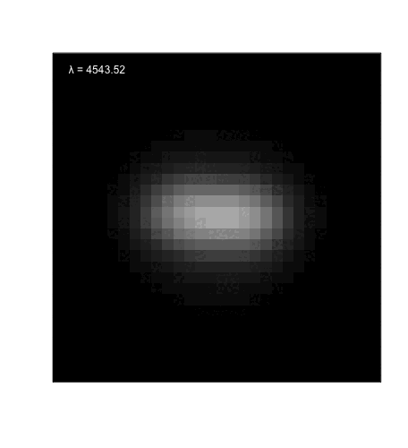

```{r, include = FALSE}
knitr::opts_chunk$set(
  collapse = TRUE,
  comment = "#>"
)
```

The purpose of the SimSpin R-package is to take a particle simulation of a galaxy and produce a spectral data cube in the style of a specified Integral Field Spectroscopy (IFS) instrument. 

In this vignette, we will take you through the process of constructing such a data cube from a particle simulation. This is a simple process comprised of three steps:

  1. Read in your particle data and produce the relevant spectra using the `make_simspin_file` function.
  1. Setup the observation by defining your `telescope` and `observing_strategy`.
  1. Build your data cube using the `build_datacube`.

From this spectral data cube, observable properties can be measured using standard observational pipelines, such as pPXF. You can see another long-form example [here](http://rpubs.com/kateharborne/713800) demonstrating how the kinematics can be fit using the spectral data cube. 

```{r setup}
library(SimSpin)
```

### Improvements from v1.1.3
*In v1.x.x of SimSpin, "kinematic" data cubes were produced. From these cubes, observables were constructed using tools within the package.* 

*SimSpin v2.x.x has been designed to generate a data product that is directly comparable to the observational equivalent IFS data cubes such that output can be analysed using observational pipelines. This means that observational data and simulation data can be processed in the same manner.*

*We have also removed some of the barriers for entry. SimSpin can now read particle files natively, making running the Python `create_SimSpin_file.py` obsolete. Simply provide the particle file as output by the simulation to the package for processing.* 

--------------------------------------------------------------------------------

# Step 1: Importing the particle files

There are a number of example particle model files included within the SimSpin package for use throughout these examples and documentation:

  * An example Gadget2 binary output file (SnapFormat=1)
  * An example Gadget2 HDF5 output file (SnapFormat=3)
  * An example EAGLE HDF5 file.

Currently, SimSpin is supported to read each of these file types through the `make_simspin_file` function. Further support will be provided for implementation of new simulations. Please take a look at the [GitHub repository](https://github.com/kateharborne/SimSpin) and report an issue for implementation of further simulation outputs. 

Each of these galaxies look a little different and contain different galaxy components. Let's begin by taking a look at each file.

**1. Gadget2 binary output file** 

This galaxy is a low resolution, N-body model of an S0 galaxy containing 1000 disk particles and 1500 bulge particles, shown by blue and red points respectively in the plots below. 

```{r}
gadget2_binary_galaxy = make_simspin_file(filename = system.file("extdata", 
                                                                 "SimSpin_example_Gadget", 
                                                                 package = "SimSpin"),
                                          disk_age=5, bulge_age=10,    # ages in Gyr 
                                          disk_Z=0.024, bulge_Z=0.001, # metallicities as a fraction of solar
                                          template="BC03lr",           # spectral template choice
                                          write_to_file = FALSE)       # output data to environment, rather than file
```

```{r, echo=FALSE, fig.dim=c(7,5), fig.align='center'}
# Code not printed in vignette as the plotting script is just to illustrate the 
#  shape of the galaxy model.

par(pty="s", fig=c(0,0.5,0,1), options(scipen = 999), xpd=FALSE, ps=12, cex=1)
magicaxis::magplot(gadget2_binary_galaxy$star_part$x[1:1000], gadget2_binary_galaxy$star_part$z[1:1000], type="p", pch=20,
                   xlim = c(-25, 25), ylim = c(-25,25), col="blue",
                   xlab = "x, kpc", ylab = "z, kpc")
points(gadget2_binary_galaxy$star_part$x[1001:2500], gadget2_binary_galaxy$star_part$z[1001:2500], pch=20, col="red")
legend("topleft", inset=c(-0.02,0.01), c("Edge-on"), bty="n")
legend("bottomright", inset=c(0.01,0.01), c("disk", "bulge"), col=c("blue", "red"), pch=c(16,16))

par(pty="s", fig=c(0.5,1,0,1), options(scipen = 999), xpd=FALSE, ps=12, cex=1, new=TRUE)
magicaxis::magplot(gadget2_binary_galaxy$star_part$x[1:1000], gadget2_binary_galaxy$star_part$y[1:1000], type="p", pch=20,
                   xlim = c(-25, 25), ylim = c(-25,25), col="blue",
                   xlab = "x, kpc", ylab = "y, kpc")
points(gadget2_binary_galaxy$star_part$x[1001:2500], gadget2_binary_galaxy$star_part$y[1001:2500], pch=20, col="red")
legend("topleft", inset=c(-0.02,0.01), c("Face-on"), bty="n")

```


**2. Gadget2 HDF5 output file**

This galaxy is a low resolution, N-body model of an slowly rotating elliptical galaxy containing 2000 bulge particles, shown the red points in the plots below. 

```{r}
gadget2_hdf5_galaxy = make_simspin_file(filename = system.file("extdata", 
                                                               "SimSpin_example_HDF5.hdf5", 
                                                               package = "SimSpin"),
                                        disk_age=5, bulge_age=10,    # ages in Gyr 
                                        disk_Z=0.024, bulge_Z=0.001, # metallicities as a fraction of solar
                                        template="BC03lr",           # spectral template choice
                                        write_to_file = FALSE)       # output data to environment, rather than file
```

```{r, echo=FALSE, fig.dim=c(7,5), fig.align='center'}
# Code not printed in vignette as the plotting script is just to illustrate the 
#  shape of the galaxy model.

par(pty="s", fig=c(0,0.5,0,1), options(scipen = 999), xpd=FALSE, ps=12, cex=1)
magicaxis::magplot(gadget2_hdf5_galaxy$star_part$x, gadget2_hdf5_galaxy$star_part$z, type="p", pch=20,
                   xlim = c(-15, 15), ylim = c(-15,15), col="red",
                   xlab = "x, kpc", ylab = "z, kpc")
legend("topleft", inset=c(-0.02,0.01), c("Edge-on"), bty="n")
legend("bottomright", inset=c(0.01,0.01), c("disk", "bulge"), col=c("blue", "red"), pch=c(16,16))

par(pty="s", fig=c(0.5,1,0,1), options(scipen = 999), xpd=FALSE, ps=12, cex=1, new=TRUE)
magicaxis::magplot(gadget2_hdf5_galaxy$star_part$x, gadget2_hdf5_galaxy$star_part$y, type="p", pch=20,
                   xlim = c(-15, 15), ylim = c(-15,15), col="red",
                   xlab = "x, kpc", ylab = "y, kpc")
legend("topleft", inset=c(-0.02,0.01), c("Face-on"), bty="n")

```


**3. EAGLE HDF5 output file**

This galaxy is taken from the EAGLE RefL0100N1504 box and sampled to reduce its size. It contains a hydrodynamical model with 1998 stellar particles.

```{r}
eagle_hdf5_galaxy = make_simspin_file(filename = system.file("extdata", 
                                                             "SimSpin_example_EAGLE.hdf5", 
                                                             package = "SimSpin"),
                                        template="BC03lr",           # spectral template choice
                                        write_to_file = FALSE)       # output data to environment, rather than file
```

```{r, echo=FALSE, fig.dim=c(7,5), fig.align='center'}
# Code not printed in vignette as the plotting script is just to illustrate the 
#  shape of the galaxy model.

par(pty="s", fig=c(0,0.5,0,1), xpd=FALSE, ps=12, cex=1)
magicaxis::magplot(eagle_hdf5_galaxy$star_part$x, eagle_hdf5_galaxy$star_part$z, type="p", pch=20,
                   xlim = c(-2, 2), ylim = c(-2,2), col="purple",
                   xlab = "x, kpc", ylab = "z, kpc")
legend("topleft", inset=c(-0.02,0.01), c("Edge-on"), bty="n")
legend("bottomright", inset=c(0.01,0.01), c("stars"), col=c("purple"), pch=16)

par(pty="s", fig=c(0.5,1,0,1), xpd=FALSE, ps=12, cex=1, new=TRUE)
magicaxis::magplot(eagle_hdf5_galaxy$star_part$x, eagle_hdf5_galaxy$star_part$y, type="p", pch=20,
                   xlim = c(-2, 2), ylim = c(-2,2), col="purple",
                   xlab = "x, kpc", ylab = "y, kpc")
legend("topleft", inset=c(-0.02,0.01), c("Face-on"), bty="n")

```


## The input of `make_simspin_file`

For the *N-body models* in examples 1 and 2 above, we need to specify an **age** and **metallicity** for the particles, as this information is not provided by the simulation inherently. These choices are necessary to associate a spectrum with each particle. This is an arbitrary choice left to the user to specify. However, it is important that the chosen parameters are within the ranges of the chosen spectral template (see below). 

For the EAGLE galaxy in example 3, which is a *hydrodynamical simulation*, the particle age and metallicity properties are tracked and included within the simulation file. SimSpin can use the provided information to associate spectra accordingly. 

We have specified the **spectral templates** used as `BC03lr`. This corresponds to the GALEXEV spectral templates complied by Bruzual and Charlot (2003). In SimSpin, we have options for using three different templates, described in the following table and plotted below to demonstrate their resolution differences. 

|  Name  | Age Steps | Age Range (Gyr) | Z Steps | Z Range (Z$_{\odot}$) | $\lambda$ Steps ($\unicode{x212B}$) | $\lambda$ Range ($\unicode{x212B}$) | 
|:--------:|:---------:|:---------------:|:-------:|:------------------:|:-----------:|:-----------------------:|
| `BC03lr` |    221    |      0 - 20     |    6    |   0.0001 - 0.05    |     1221    | 91 - 20000              | 
| `BC03hr` |    221    |      0 - 20     |    6    |   0.0001 - 0.05    |     6990    | 91 - 20000              | 
| `EMILES` |    53     |   0.03 - 14     |   12    |   0.0001 - 0.04    |    53689    | 1680.2 - 20000          | 


Spectral Templates: 

 * `BC03lr` -- a low resolution GALEXEV set compiled from Bruzual and Charlot 2003 computed for a Chabrier IMF and Padova Isochrones.
 * `BC03hr` -- a high resolution GALEXEV set compiled from Bruzual and Charlot 2003 computed for a Chabrier IMF and Padova Isochrones.
 * `EMILES` --  a high resolution E-MILES set compiled by Vazdekis et al. 2016 computed for a Chabrier IMF and Padova Isochrones.

Further templates will be incorporated over time. Keep an eye on the [GitHub repository](https://github.com/kateharborne/SimSpin) for any additions or report an issue for the inclusion of a specific set of templates. 

```{r, echo=FALSE, fig.dim=c(7,5), fig.align="center"}
# Code not printed in vignette as the plotting script is just to illustrate the 
#  shape of the galaxy model.
BC03lr = SimSpin::BC03lr
BC03hr = SimSpin::BC03hr
EMILES = SimSpin::EMILES

par(xpd=FALSE, ps=12, cex=1)
magicaxis::magplot(EMILES$Wave, EMILES$Zspec[[6]][25,],
                   type="l", log="x",
                   xlab="Wavelength / Ang", ylab="Lsun / Ang (for 1 Msun/Yr SFR)", 
                   lwd=1, col="blue", xlim = c(3000, 8000), ylim = c(0,0.0002))
lines(BC03hr$Wave, BC03hr$Zspec[[3]][145,],
      lwd = 2, col="red")
lines(BC03lr$Wave, BC03lr$Zspec[[3]][145,], 
      lwd=2, col="orange")
legend("topright", inset=c(0.01,0.01), c("BC03lr", "BC03hr", "EMILES"), col=c("orange", "red", "blue"), lty=c(1,1,1), lwd= c(3,3,3))

```

The choice of templates from which to construct your particle spectra will be dependent on the science you wish to achieve with your data cube observations. *It is also important that, for an N-body model, you choose age and metallicity parameters that fall within the range of the chosen spectral template.* 

Finally, we have chosen to **write the output SimSpin file to the environment**, rather than saving the information to a file. This is specified by `write_to_file = FALSE`. However, this is not the default option. Usually, it is advisable to save this data to a file such that the same information can be accessed for repeat observations in separate sessions. 

## The output of `make_simspin_file`

Using the `make_simspin_file` function, we have reconstructed the raw input particles into a standard format that can be processed by the rest of the package. The output of this function includes a list of 3 elements, whose properties are described below.

`make_simspin_file` 

* `star_part` -- *data.frame* -- This contains a data table of the particle properties, including the IDs, positions (physical kpc), velocities (km/s), initial and current masses (10$^{10}$ solar masses), and the SED ID corresponding the to spectrum index of that particle. These properties are listed for each particle in the simulation. 
* `spectra` -- *List* -- This list contains the individual spectra associated with each. The number of unique spectra is dependent on the input simulation. Particles are matched to their relevant spectra by the SED ID value in the `star_part` table. That SED ID corresponds to the row number in the `spectra` list. i.e. `sed_id = 2` corresponds to the spectrum in row 2 of the `spectra` list (accessed via `spectra[[2]]`).
* `wave` -- *numeric* -- This 1D array contains the wavelength units for each spectrum in the `spectra` list.
  
All simulations, no matter if they are N-body models or hydrodynamical simulations, will produce the *same output type*. This output type can then be used to construct a data cube. 

--------------------------------------------------------------------------------

# Step 2: Building a telescope and observing strategy

Once you have the simulation prepared for observation, we need to decide which telescope we will use to observe our galaxy. This is done simply using the `telescope` class within SimSpin. 

```{r}
IFU = telescope(type            = "IFU", # allowing us to define all parameters
                fov             = 15,    # field of view of the aperture in arcsec
                aperture_shape  = "circular", # shape of the aperture
                wave_range      = c(3700, 5700), # wavelength range in angstrom
                spatial_res     = 0.5,  # size of spatial pixels in arcsec
                wave_res        = 2.04, # wavelength resolution in angstrom
                lsf_fwhm        = 3.65, # full-width-half-max of the line spread function
                signal_to_noise = 10)   # uniform value applied to all spectra
```

This provides a telescope object that can be used to observe your simulation. Alternatively, we can use one of the inbuilt instruments, such as SAMI, simply by specifying `type = "SAMI"` as shown below.

```{r}
SAMI = telescope(type = "SAMI") # for this option, all parameters have been pre-defined
```

Other `type` predefined include `MaNGA`, `CALIFA` and `Hector`. This input is NOT case sensitive. Not all of these instruments have fixed parameters, however. For example, the field of view of the MaNGA instrument can be changed dependent on the size of the object being observed. Similarly, the `SAMI` type defines the blue arm of the spectrograph, as this is commonly used for stellar kinematics. The broad definitions given here may need tweaking for your exact situation. We encourage users to consider this when setting the `telescope` class. 

We then need to decide how our object is projected and placed on the sky. This is done using the `observing_strategy` class.

```{r}
strategy_one = observing_strategy(dist_z         = 0.05,# redshift distance at which the galaxy is placed
                                  inc_deg        = 75,   # projected inclination on the sky (0 - face-on, 90 - edge-on)
                                  blur           = F)    # whether seeing conditions are included
```

We can also add observational blurring due to the seeing conditions in which the observation is made.

```{r}
strategy_two = observing_strategy(dist_z         = 0.03,# redshift distance at which the galaxy is placed
                                  inc_deg        = 75,   # projected inclination on the sky (0 - face-on, 90 - edge-on)
                                  twist_deg      = 180,  # angle of observation (longitude)
                                  blur           = T,    # whether seeing conditions are included
                                  fwhm           = 2,    # the full-width-half-max of the blurring kernel in arcsec
                                  psf            = "Gaussian") # the shape of the blurring kernel
```

This provides an observing strategy object that describes the observational properties of your model.  

With the telescope and observing strategy defined, we can now observe our model. 

--------------------------------------------------------------------------------

# Step 3: Building the data cube

Finally, we can observe our simulated galaxies using the `build_datacube` function. In this, we specify the SimSpin file, the observing telescope and the observing strategy. The produced data cube can also be saved to a FITS file for further processing with pPXF, for example. 

```{r}
gadget2_binary_cube = build_datacube(simspin_file = gadget2_binary_galaxy,
                                     telescope = IFU,
                                     observing_strategy = strategy_one,
                                     method = "spectral",
                                     write_fits = FALSE)
```

This output produced by `build_datacube` is a list with 4 elements as described below.

`build_datacube`

1. `spectral_cube` -- *3D numeric array* -- This describes your 3D spectral data cube. The axes of the cube are [spatial x spatial x wavelength] and the values within the cube are given in CGS units (erg/s/cm$^{2}$/$\unicode{x212B}$). 
2. `observation` -- *List* -- A list of 22 elements that describe the specifics calculated for that specific observation. Generally describes the details you've entered with regards to the `telescope` and `observing_strategy` objects, as well as other properties derived from this information. Includes information about the units of the cube dimensions. 
3. `raw_images` -- *List* -- A list of 2D arrays corresponding to various properties of the binned raw particle data within the observation.  Within this list, there are four key comparison images. 
    + `flux_image` -- *2D numeric array* -- This is a 2D array that represents the sum of the individual particle flux along that spaxel. 
    + `velocity_image` -- *2D numeric array* -- This is a 2D array that represents the physical, mean line-of-sight (LOS) velocity of the particles within each spaxel of your image. This is provided for comparison with the fit LOS velocity image produced through spectral analysis. 
    + `dispersion_image` -- *2D numeric array* -- This is a 2D array that represents the physical, mean LOS velocity dispersion of the particles within each spaxel of your image. This is provided for comparison with the fit LOS velocity dispersion image produced through spectral analysis.
    + `particle_image` -- *2D numeric array* -- This is the final 2D array that contains the number of particles contained in a given pixel. 
4. `observed_images` -- *List* -- This will be `NULL` for spectral data cubes, but when used in `velocity` mode, this list will contain 2D arrays that correspond to the observed flux/mass, LOS velocity and LOS dispersion calculated using the collapsed velocity cube. 

```{r, echo=FALSE, fig.dim=c(7,5), fig.align='center'}

image_nan <- function(z, zlim, col, na.color='gray', ...){
  zstep <- (zlim[2] - zlim[1]) / length(col); # step in the color palette
  newz.na <- zlim[2] + zstep # new z for NA
  
  z[which(is.na(z>zlim[2]))] <- newz.na # same for newz.na
  
  zlim[2] <- zlim[2] + zstep # extend top limit to include the new value na
  
  col <- c(col, na.color) # we construct the new color range by including: na.color
  
  magicaxis::magimage(z=z, zlim=zlim, col=col, ...) # we finally call image(...)
}
velo_map_cols = rev(colorRampPalette(RColorBrewer::brewer.pal(9, "RdYlBu"))(40))
disp_map_cols = colorRampPalette(RColorBrewer::brewer.pal(9, "YlOrRd"))(50)

vel_val = max(c(abs(min(gadget2_binary_cube$raw_images$velocity_image, na.rm = T)), abs(max(gadget2_binary_cube$raw_images$velocity_image, na.rm = T))))
disp_val = c(floor(min(gadget2_binary_cube$raw_images$dispersion_image, na.rm=T)/2), max(gadget2_binary_cube$raw_images$dispersion_image, na.rm=T))

par(pty="s", fig=c(0,0.5,0,1), options(scipen = 999), xpd=FALSE, ps=12, cex=1)  
image_nan(z = gadget2_binary_cube$raw_images$velocity_image, zlim = c(-vel_val,vel_val), col = velo_map_cols, na.color = "white", xaxt="n",
          yaxt="n", ann=FALSE, magmap=FALSE, family="mono", font=1)
rect(14,14,15,15, col=NA, lty=1, lwd=3, border="red")
fields::image.plot(legend.only = TRUE, zlim = c(-vel_val,vel_val), col = velo_map_cols,
                   horizontal = TRUE, family="serif", font=1,
                   legend.lab = expression("velocity"[LOS] * ", km s"^{-1}))

par(pty="s", fig=c(0.5,1,0,1), options(scipen = 999), xpd=FALSE, ps=12, cex=1, new=TRUE)  
image_nan(z = gadget2_binary_cube$raw_images$dispersion_image, zlim = disp_val, col = disp_map_cols, na.color = "white", xaxt="n",
          yaxt="n", ann=FALSE, magmap=FALSE, family="mono", font=1)
rect(14,14,15,15, col=NA, lty=1, lwd=3, border="red")
fields::image.plot(legend.only = TRUE, zlim = c(disp_val), col = disp_map_cols,
                   horizontal = TRUE, family="serif", font=1,
                   legend.lab = expression("dispersion"[LOS] * ", km s"^{-1}))


```

Here, we have plotted the `velocity_image` and `dispersion_image` calculated from the particle data. We have highlighted a single spaxel. The spectrum associated with this spaxel is shown in the figure below. Such a spectrum is present in all occupied spaxels of the image. 

```{r, fig.dim=c(7,5)}
par(options(scipen = 0), xpd=FALSE, ps=12, cex=1)  

magicaxis::magplot(gadget2_binary_cube$observation$wave_seq,
                   gadget2_binary_cube$spectral_cube[15,15,]/median(gadget2_binary_cube$spectral_cube[15,15,]),
                   type="l", lty=1, lwd=2, col ="blue",
                   ylab= "Normalised Flux", xlab = "Wavelength, Ang")
```

These spectra can be provided to an observational software, such as pPXF, for fitting and recovery of the LOS velocity and velocity dispersion maps. To do so, it is best to save these observations to a FITS file. This can be done by specifying `write_fits = TRUE` and the path to the desired save location `output_location = "/PATH/to/.FITS"`, as demonstrated below.

```{r}
temp_loc = tempdir(check = T)

eagle_hdf5_cube = build_datacube(simspin_file    = eagle_hdf5_galaxy,
                                 telescope       = SAMI,
                                 observing_strategy = strategy_two,
                                 write_fits      = TRUE,                               # write results to a FITS file
                                 output_location = file.path(temp_loc, "eagle_obs.FITS")) #   at this location

```

Below, we demonstrate how to open and view the data using a FITS reader package called `Rfits`. 

```{r}
library(Rfits)

cube = Rfits::Rfits_read_all(file.path(temp_loc, "eagle_obs.FITS"))

spectral_cube = cube[["DATA"]]$imDat # The spectral data cube is stored in the first HDU (can also be accessed cube$imDat).
                                     # The cube has dimensions [spatial x spatial x wavelength].
header = cube[["DATA"]]$keyvalues    # The keyvalues header of the file gives everything 
                                     # you need to assign values to the cube axes.

spatial_range = header$CRVAL1 + (seq(header$CRPIX1, header$NAXIS1)*header$CDELT1)
                    # We use the first or second inputs to the axDat to describe the spatial axes of the cube. As
                    # the aperture is square, the first and second inputs give the same answer.

wavelength_range = header$CRVAL3 + (seq(header$CRPIX3, header$NAXIS3)*header$CDELT3)
                    # Because the wavelength is the third axis of the cube, we use the third element in the axDat 
                    # element to define the wavelength range. 

```

We define the key elements of the `keyvalues` header in the table below:

+:--------+:-------------------------------------------------------------------+
|  CRPIX  |  The pixel index at which values are defined. Default (1,1,1).     |
+---------+--------------------------------------------------------------------+
|  CRVAL  |  The value associated with the `CRPIX` pixel.                      |
+---------+--------------------------------------------------------------------+
|  CDELT  |  The difference in value between each pixel.                       |
+---------+--------------------------------------------------------------------+
|  NAXIS  |  The dimensions of the cube (number of pixels along each axis).    |
+---------+--------------------------------------------------------------------+
|  CTYPE  |  The name that defines each dimension of the cube.                 |
+---------+--------------------------------------------------------------------+
|  CUNIT  |  The units for each dimension of the cube.                         |
+---------+--------------------------------------------------------------------+

These values can be used to reconstruct the data cube for kinematic fitting. 

We can examine an image of the wavelength slices in the cube by plotting each slice in the gif below. Alternatively, such a FITS file can also be examined using tools like [SAOImageDS9](https://sites.google.com/cfa.harvard.edu/saoimageds9).

```{r, echo=FALSE, message=FALSE, warning=FALSE, results='hide', fig.align='center', fig.dim=c(7,5)}
par(pty="s", options(scipen = 999), xpd=FALSE, ps=12, cex=1)  
sub_cube = spectral_cube[,,seq(763,1162,by=16)]
sub_wave = wavelength_range[seq(763,1162,by=16)]
flux_val = c(min(sub_cube, na.rm = T), max(sub_cube, na.rm = T))
png(file="SAMI_cube_phys%02d.png", width=456, height=500)
for (i in 1:25){
  image_nan(z = asinh(sub_cube[,,i]), zlim = flux_val, col = grey((0:1000)/1000), na.color = "white", xaxt="n",
          yaxt="n", ann=FALSE, magmap=FALSE, family="mono", font=1)
  legend("topleft", inset=c(-0.01,0.01), parse(text=sprintf('lambda == %s',sub_wave[i])), bty="n")
}
dev.off()

system("convert -delay 40 *.png SAMI_cube_phys.gif")
file.remove(list.files(pattern=".png"))
```


```{r, echo=FALSE}
unlink(file.path(temp_loc, "eagle_obs.FITS"))
```

This brings us to the end of this walk-through. We have demonstrated how to:

   1. Read in a variety of different particle simulations for processing using `make_simspin_file`.
   1. Construct a variety of different `telescope` and `observing_strategy` classes for different observing requirements.
   1. Generated two data cubes using these classes via `build_datacube` and demonstrated how this output can easily be saved to a FITS file.
   1. Demonstrated how to open and explore the saved FITS file from within R. 
  
For further processing scripts and walk-throughs, please check out [Rpubs](https://rpubs.com/kateharborne). For example, for an example of fitting these data cubes for the stellar kinematics, please see [this RMarkdown file.](http://rpubs.com/kateharborne/713800)

--------------------------------------------------------------------------------
### References
  * *BC03 (low and high resolution)* - Bruzual and Charlot, 2003, MNRAS, 344, 1000
  * *EMILES* - Vazdekis et al., 2016, MNRAS, 463, 3409
  * *Padova isochrones* - Bertelli et al., 1994, A&AS, 106, 275 
  * *Chabrier IMF* - Chabrier, 2003, PASP, 115, 763

